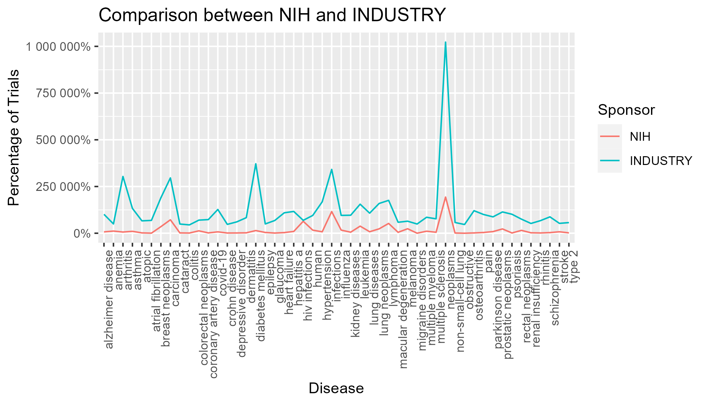
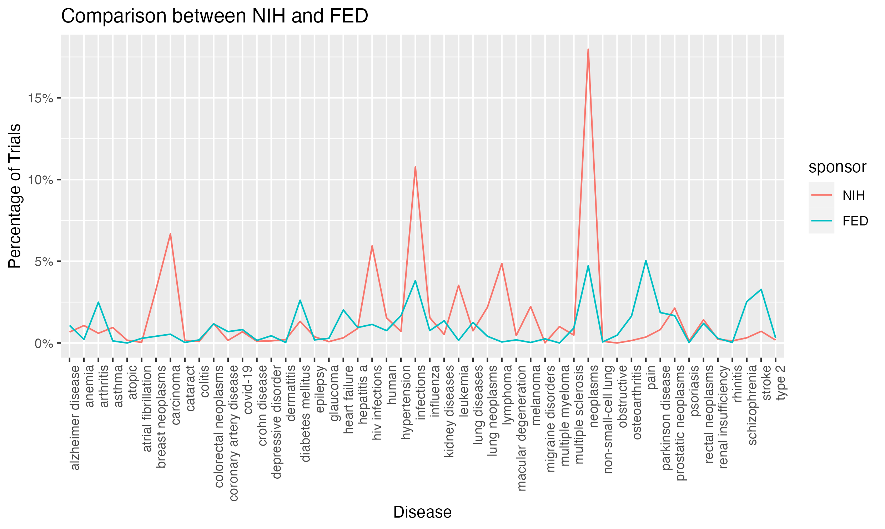

```{r setup, include=FALSE}
knitr::opts_chunk$set(echo = F, warning = F, message= F, fig.cap = " ")
library(astsa)
library(dplyr)
library(ggplot2)
library(lubridate)
library(reshape2)
library(tidyr)
load("../data/studies.rda")
```

# Introduction

### Background

Clinical trials are fundamental to the advancement of medical science and healthcare. The sponsorship of these trials plays a crucial role in their conception, design, and execution. Traditionally, clinical trials are sponsored by a variety of entities including pharmaceutical companies, government agencies, academic institutions, and non-profit organizations. Each sponsor type comes with its own set of priorities and interests, which can influence the nature and focus of the clinical trials they support.

Recent trends have shown a diversification in the types of clinical trials being conducted, partly due to the evolving landscape of medical research and the emergence of new health challenges. Understanding the preferences of different sponsor types is important for several reasons. It can reveal insights into the priorities of the healthcare industry, inform researchers and policy-makers about potential gaps in medical research, and guide future investments in certain areas of healthcare. 

### Purpose

The primary objective of this study is to analyze the distribution of clinical trials across different medical domains, as categorized by Medical Subject Headings (MeSH) terms, and associate them with various sponsor types. Furthermore, for those MeSH terms most frequently associated with sponsorship, this study elucidates the temporal patterns of clinical trials in these popular domains, and forecasts future trends. This could potentially identify emerging areas of interest and allow stakeholders to anticipate shifts in the focus of clinical research.

The study’s findings can inform policy decisions regarding the allocation of research funds and ethical considerations in clinical trials. Researchers can use this information to advocate for funding in underrepresented medical domains, ensuring a more balanced approach to medical research.

### Dataset Variables


The study uses a dataset from ClinicalTrials.gov, a registry of clinical studies involving human participants globally, maintained by the National Library of Medicine at the NIH. This database offers details on the design, conduct, and results of clinical trials, aiming to provide accessible information to the public, patients, healthcare providers, and researchers. The data for this study is available through the R package *"bis620.2022"*,  which includes various variables related to different aspects of clinical trials.

Table: Data Description

| Variable| Description |
|----------|---------------------------------------|
| `nct_id`           | Unique identifier for each clinical trial. |
| `conditions`       | Medical conditions or diseases studied in the trial. |
| `country`          | The country where the clinical trial is registered. |
| `url`              | Web URL link to more information about the trial (if available). |
| `source_class`     | Classification of the trial sponsor (NIH, INDUSTRY, NETWORK, FED, OTHER_GOV, INDIV, UNKNOWN, OTHER). |
| `country_facility` | The location of the medical facility where the trial is conducted. |
| `downcase_mesh_term` | The Medical Subject Headings (MeSH) terms associated with the trial, in lowercase. |
| `keyword`          | Keywords related to the trial. |
| `phase`            | The phase of the clinical trial. |
| `start_date`       | The date when the trial began. |
| `completion_date`  | The anticipated or actual completion date of the trial. |
| `brief_title`      | A brief title of the clinical trial. |
| `state`            | The state (if applicable within the USA) where the trial is registered or conducted. |


# Methodology

## Sponsor Type Preference Research 

### Select Top MeSH Terms

The 'downcase_mesh_term' column in the 'studies' data frame, containing comma-separated MeSH terms, is split to separate each term into distinct rows. This process allows each MeSH term to be analyzed individually. Studies with multiple MeSH terms are divided into separate rows. Subsequently, the number of trials associated with each MeSH term is counted. Only the top 100 MeSH terms with the highest number of trials are retained for further analysis.

### Generate Sponsor Type vs MeSH Term Matrix

For the hypothesis testing, the study creates a matrix comparing sponsor types to MeSH terms, showing the count of trials per MeSH term and sponsor type. These counts are normalized by dividing them by the column sums, turning each entry into a fraction representing the proportion of trials for a MeSH term within a sponsor type. Thus, each column reflects the distribution of MeSH terms for each sponsor. One matrix is utilized for count data and Chi-Squared tests, while the other, with normalized data, is used for line chart analysis.

### Perform Chi-Squared Test

The chi-squared test is to assess whether there is a statistically significant difference in the distribution of clinical trials among various sponsor types. The chi-square test is a statistical method used to determine if there is a significant difference between expected frequencies and observed frequencies in one or more categories. The null hypothesis of Chi-Square test is:

$H_0$ = there is no association between the two variables(independent).

$H_1$ = there is association between the two variables.


Using the count matrix generated before, perform pairwise Chi-Squared test on each two columns(one column in count data and another in fraction data) and generate a sponsor type against sponsor type matrix, each entry indicating the Chi-Squared test p-value of two sponsor types.

## Time Series Analysis for Top MeSH Terms:
   - For the MeSH terms that are most prevalent among the sponsors, we will conduct a time series analysis. This involves analyzing the pattern and frequency of trials over time to identify trends and potentially predict future areas of interest.
   - The time series analysis will help in understanding the dynamics of sponsor preferences over time and may provide insights into emerging trends in clinical research areas.

 - Objectives:
Descriptive Analysis: Understanding the main features of the data, including the identification of trends, seasonality, and other cycles.
Forecasting: Predicting future values in the series based on the historical patterns and structures identified.
Intervention Analysis: Assessing the impact of a one-off event or a new policy.
Explanatory Models: Understanding the relationships between the time series and other variables.

 - Methods:
Smoothing Techniques: Methods like moving averages or exponential smoothing, used to remove noise and highlight trends and seasonality.
Autoregressive (AR) Models: Models that use a weighted sum of past observations to predict future values.
Moving Average (MA) Models: Models that use a weighted sum of past forecast errors.
Autoregressive Integrated Moving Average (ARIMA) Models: Combining AR and MA models with differencing to make the data stationary.
Seasonal ARIMA (SARIMA) Models: Extending ARIMA models to account for seasonality.
Vector Autoregression (VAR) Models: Multivariate time series models that capture the linear interdependencies among multiple time series.
State Space Models and Kalman Filtering: Flexible models that allow for the modeling of more complex phenomena and are able to handle missing data.

 - Model Selection:
Model selection involves choosing the best structure and parameters based on criteria like the Akaike Information Criterion (AIC) or the Bayesian Information Criterion (BIC).

 - Forecasting:
Once a model is selected and validated, it can be used to make forecasts. The accuracy of these forecasts can be evaluated using metrics such as the Mean Absolute Error (MAE) or the Root Mean Squared Error (RMSE).


### ACF and PACF & SARIMA Model
The Autocorrelation Function (ACF) and Partial Autocorrelation Function (PACF) plots are tools used to help identify the order of an ARIMA model. The acronym SARIMA stands for Seasonal Autoregressive Integrated Moving Average, and it is an extension of ARIMA models that also includes seasonal terms. The SARIMA model can be represented as SARIMA(p, d, q)(P, D, Q)s, where:

 - p is the order of the Autoregressive (AR) term
 - d is the order of differencing
 - q is the order of the Moving Average (MA) term
 - P is the order of the seasonal Autoregressive (SAR) term
 - D is the order of seasonal differencing
 - Q is the order of the seasonal Moving Average (SMA) term
 - s is the length of the seasonal period
 
The number of significant spikes in the PACF plot indicates the order of the AR term (p). The number of significant spikes in the ACF plot after differencing indicates the order of the MA term (q). For seasonal components, you would look at the lag that corresponds to the seasonal period in the ACF and PACF plots. Since you've indicated a seasonal period of 12, you would look at every 12th lag. If the ACF and PACF plots show significant spikes at multiples of the seasonal period, this would indicate the need for seasonal AR (P) or MA (Q) terms. The order of seasonal differencing (D) is typically determined by conducting seasonal differencing and then checking the plots again. If your data has already been seasonally differenced or if the seasonal patterns have been removed, D might be 0. The order of non-seasonal differencing (d) is usually determined by the need to make the series stationary. 


# Results

## First part: Sponsor Type Preference Research 
The Chi-Test results are stored in a $8 \times 8$ matrix, representing the p-value of Chi statistics. If a p-value is less than or equal to 0.05, it suggests a statistically significant association between the categories; if it's greater than 0.05, it suggests no significant association. 

Table: p-value of Chi statistics matrix 

|    |OTHER  |NIH    |INDUSTRY|NETWORK |FEDERAL   |OTHER GOVERNMENT|INDIVIDUAL|UNKNOWN |
|-------|-----|-------|-------|---------|---------|-----------|-----------|-------|
|OTHER |  | 0.19  | 0.27  | 0.31    | 0.31      | 0.16    | 0.40    | 0.00 |
|NIH   |  | 0.00  | 0.40  | 0.00    | 0.01      | 0.01    | 0.19    | 0.00 |
|INDUSTRY|   |   |   | 0.30    | 0.50      | 0.47    | 0.31    | 0.00 |
|NETWORK |   |   |   |     | 0.61      | 0.01    | 0.00    | 0.00 |
|FEDERAL   |   |   |   |     |       | 0.00    | 0.00    | 0.00 |
|OTHER GOVERNMENT  |   |   |   |     |       |     | 0.02    | 0.00 |
|INDIVIDUAL|   |   |   |     |       |     |     | 0.00 |
|UNKNOWN |   |   |   |     |       |     |     |  |

Interpreting the p-value matrix by focusing on categories other than "OTHER" and "UNKNOWN", we can draw conclusions about the associations between the remaining categories: NIH, INDUSTRY, NETWORK, FEDERAL, OTHER GOVERNMENT, and INDIVIDUAL. The p-values are interpreted under the standard statistical significance threshold, usually set at 0.05.


### Key Interpretations:
To visualize the association of the preference of every two sponsor types, we used several line charts to plot the fraction of MeSH terms for each sponsor type. 


 **NIH vs. INDUSTRY**: P-value of 0.40 suggests no significant association.
 
 
 { width=80% }
 
 **NIH vs. FEDERAL**: P-value of 0.01, suggesting a significant association.
 
 
  { width=80% }
  
  ### Summary of Findings:

- **Significant Associations**: There are notable significant associations between several pairs of categories, like NIH vs. NETWORK, NIH vs. FEDERAL, NIH vs. OTHER GOVERNMENT, NETWORK vs. OTHER GOVERNMENT, NETWORK vs. INDIVIDUAL, FEDERAL vs. OTHER GOVERNMENT, and FEDERAL vs. INDIVIDUAL, indicating there are preference similarity between this sponsor types.
- **No Significant Associations**: Several pairs, such as NIH vs. INDUSTRY and INDUSTRY vs. NETWORK, show no significant associations, which highlights the difference between preferences of different sponsor types.


## Second Part: Time Series Analysis 

```{r}
studies <- studies %>% filter(!is.na(downcase_mesh_term))

studies$url <- NULL
studies$keyword <- NULL
studies$conditions <- NULL
studies$brief_title <- NULL

studies <- separate_rows(studies, downcase_mesh_term, sep = ",\\s*")

studies_summary <- studies %>%
  group_by(downcase_mesh_term) %>%
  summarise(total_count = n()) %>%
  ungroup() %>%
  arrange(desc(total_count)) %>%
  as.data.frame()

studies_list <- mapply(
  function(term, count) c(term, count),
  studies_summary$downcase_mesh_term,
  studies_summary$total_count,
  SIMPLIFY = FALSE 
)


```


As students specializing in Biostat in America, we have synthesized key findings from top mesh terms conducted by authoritative institutions. With an avid interest in the progression of these pivotal trials, we aim to forecast the trends of these top mesh terms over the coming year (12 months). To achieve this, we are employing *"time series analysis"* as our predictive tool, enabling us to model and predict the directional flow and dynamics of these trials based on historical data patterns of past 10 years (2013.01-2023.12). 

Table: Top 5 mesh terms in U.S

|Ranking|Mesh Term| Total Count|
|----------|----------|-------|
|1|neoplasms	|1386	|		
|2|carcinoma	|1364	|		
|3|diabetes mellitus |1159|			
|4|lymphoma	|1031	|		
|5|leukemia	|848	|

Table.3 shows the **top 5** mesh terms in United State, whose sponsor including NIH, INDUSTRY, NETWORK, FED, OTHER_GOV. Since "neoplasms & carcinoma" are very general mesh terms, we choose the top 3 and 4 **"diabetes mellitus"** and **"lymphoma"** as our target mesh terms, and aim to **forcast the next 12 months**.


```{r}
# Filter both dates before 2023-12-01 & U.S
studies_clean <- studies %>% filter(country == "United States") %>% 
  filter(!is.na(source_class)) %>% filter(source_class != "UNKNOWN") %>% 
  filter(source_class != "INDIV") %>% filter(source_class != "OTHER") %>% 
  filter(!(is.na(start_date) & is.na(completion_date))) 


top10_mesh_term <- studies_clean %>% 
  group_by(downcase_mesh_term) %>%
  summarise(total_count = n()) %>%
  ungroup() %>%
  arrange(desc(total_count)) %>%
  as.data.frame()


# Calculate mean
average_duration <- mean(na.omit(studies_clean$completion_date - studies_clean$start_date))

# Impute missing dates 
studies_clean$start_date[is.na(studies_clean$start_date)] <- 
  studies_clean$completion_date[is.na(studies_clean$start_date)] - average_duration

studies_clean$completion_date[is.na(studies_clean$completion_date)] <- 
  studies_clean$start_date[is.na(studies_clean$completion_date)] + average_duration


studies_clean$start_date <- as.Date(studies_clean$start_date)
studies_clean$completion_date <- as.Date(studies_clean$completion_date)

```


```{r}
create_ts <- function(mesh_term) {
  library(dplyr)
  library(tidyr)
  library(lubridate)

 monthly_counts <- mesh_term %>%
    rowwise() %>%
    do(data.frame(month = seq(.$start_date, .$completion_date, by = "month"))) %>%
    count(month = floor_date(month, unit = "month"))

# Create a vector of all counts
counts_vector <- as.vector(t(monthly_counts[,-1])) 

# The frequency is 12 for monthly data, and the start is the first month of the first year
ts_counts <- ts(counts_vector, start=c(monthly_counts$year[1], 2013), frequency=12)

  return(ts_counts)
}

```

We should recognize that, to apply the method of "time series analysis", we are required to transform the date ranges of 'start date' and 'completion date' for each entry into a time series object that can be analyzed or used to predict future trends, which is particularly useful for tracking the frequency or count of events over time. Firstly, creating a sequence of months between 'start_date' and 'completion_date'. Secondly, tally the occurrences of each month across all sequences. Finally, reshape the tallied counts into a time series object format with "years" as rows and "months" as columns.


### Mesh term 1: Diabetes Mellitus
### Exploring the time series plot (Diabetes Mellitus)

```{r, warning=FALSE, fig.height=3.3, fig.width=8, fig.cap = "Monthly Diabetes Mellitus Studies in U.S (2013-2023) "}
mesh_term_1 <- studies_clean %>% filter(downcase_mesh_term == "diabetes mellitus") %>%
  filter(start_date < as.Date("2023-12-01") & start_date > as.Date("2007-12-31") & completion_date < as.Date("2030-12-01")) 

ts1_data <- create_ts(mesh_term_1)
ts1_data_filtered <- window(ts1_data, start = c(2010, 1), end=c(2022, 12))
plot(ts1_data_filtered, ylab = "Number of diabetes studies")
```


The time series plot Fig.1 for "Monthly Diabetes Mellitus Studies" in America spanning from 2013 to 2023 appears to exhibit a cyclical pattern, with the number of studies fluctuating periodically over time. The trend does not show a clear upward or downward direction but rather peaks and troughs that suggest a regular seasonal variation. There is no obvious long-term trend indicating an increase or decrease in the overall volume of studies over the ten-year period. However, toward the latter part of the timeline, there seems to be a slight decrease in the amplitude of fluctuations.


### Apply some transformations or differencing to convert stationary process (Diabetes Mellitus)

```{r, fig.height=5, fig.width=8, fig.cap = "Combination of original $x$, logged transformed: $lx = log(x_t)$, differenced: $dlx$, $ddlx$ for Diabetes Mellitus "}
x = ts1_data_filtered
lx = log(ts1_data_filtered)
# Plot the first difference of the data
dlx = diff(lx)
ddlx = diff(dlx, 12)
plot.ts(cbind(x, lx, dlx, ddlx), main= '')
```

Next, fig.2 is the combination of 4 plots based on three transformed processes. The first plot "x" is the original series showing trend as the plot of "Monthly Diabetes Mellitus Studies in U.S. (2013-2023)". 

Hence, we need to do a log transform, which stabilizes the variance, "lx" is the logged data $lx = log(x_t)$. 

*Differencing* is needed, the logged data $lx = log(x_t)$ is then differenced to remove the *trend*, being stored in $dlx=\nabla log(x_t)$.

 A twelfth-order difference is applied and stored in $ddlx= \nabla_{12} \nabla log(x_t)$.
 


```{r, echo=FALSE, fig.height=3, fig.width=10, fig.cap = "Plot of showing seasonal for $dlx$, $ddlx$ for Diabetes Mellitus "}
# below of interest for showing seasonal
par(mfrow=c(1,2))
monthplot(dlx)
monthplot(ddlx)
```

Moreover, by plotting the seasonal and seasonal-irregular components of "dlx", shown below fig.3(dlx), the straight line shows the average monthly diabetes mellitus studies in America over the whole sample period, and the data are clearly non-stationary, with some seasonality, so we require to next take a seasonal difference. 

Therefore, a twelfth-order difference is applied and stored in $ddlx= \nabla_{12} \nabla log(x_t)$. Also, by plotting the seasonal and seasonal-irregular components of it as shown in below fig.3(ddlx), the transformed data appears to be stationary and we are now ready to fit a model.

\

### Identify the dependence orders of model (Diabetes Mellitus)

Now we use the preprocessed data to fit models. The sample ACF and PACF of $\nabla_{12}\nabla log(x_t)$ shown in fig.4

```{r, echo=FALSE, fig.height=4, fig.width=6.5, fig.cap = "sample ACF and PACF of logged Diabetes Mellitus Studies"}
# Plot the acf and pacf
plt = acf2(ddlx,50)
```

We would fit a SARIMA model for logged data, the sample ACF and PACF of $ddlx(\nabla_{12}\nabla log(x_t))$ are shown in the above fig.4.

 - Seasonsal Component (P,D,Q): From the ACF and PACF, there are no significant spikes at the seasonal lags, suggesting P=0 and Q=0. Also, since we use $ddlx= \nabla_{12} \nabla log(x_t)$, which has already been seasonally differenced, D might be 0. Hence we may consider trying P = 0, Q = 0, D = 0, s = 12.

 - Non-Seasonsal Component (p,d,q): In fig.4 PACF plot, there are no significant spikes after the first lag, so p might be 0 or 1. Similarly, from the ACF plot, the first lag is significantly different from zero, so we would consider an MA term (q=1), hence we may consider trying p = q = 1, d=1, s=12.
 - Possible SARIMA model for could be SARIMA(0,0,1)(0,0,0)12 or SARIMA(1,0,1)(0,0,0)12.


### Estimate the parameters for the proposed models (Diabetes Mellitus)

We find the best model is $ARIMA(1,0,1)\times(0,0,0)_{12}$ on the logged data:

```{r, echo=FALSE, results='hide', fig.height=4.5, fig.width=6, fig.cap = "Residual analysis for $ARIMA(1,0,1)\times(0,0,0)_{12}$ logged Diabetes Mellitus Studies"}
model1 = sarima(lx, 1,0,1, 0,0,0,12)
print(model1$ttable)
```

For $ARIMA(1,0,1)\times(0,0,0)_{12}$ in fig.5, The residuals oscillate around the zero line without displaying any obvious patterns or trends, which generally indicates a good fit. And from the ACF of residuals, all the autocorrelation coefficients are within the blue dashed confidence intervals, which suggests that there is no significant autocorrelation in the residuals. The points in the Q-Q plot lie fairly close to the line, which suggests that the residuals are approximately normally distributed. However, there is some deviation at the ends. Moreover,in the Ljung-Box statistics plot, the p-values are well above the 0.05 significance threshold, indicating that there is no significant autocorrelation at those lags, which is another sign that the model is fitting well.

\


### Estimate the parameters for the proposed model & Test significance (Diabetes Mellitus)

For $ARIMA(1,0,1)\times(0,0,0)_{12}$ : 

$$(1 -\phi_{1}\operatorname{B} )\ \nabla logx_t = (1 +\theta_{1}\operatorname{B} )\ w_{t}$$

By fitting the model selected in previous section, we got parameter estimations and corresponding p-values as listed in Table 4:


Table: Summary of parameter estimate and p-value 

|| $\phi_1$ | $\theta_1$ |
|------------|-------|------|
|parameter estimate|0.9827|-0.8674|
|p-value|0|0|


Based on the significance test result, we can observe that the p-values for all of the parameters are much smaller than significance level (0.05). By adding the coefficients into the final model, we have:

$$(1 - 0.9827\operatorname{B} )\ \nabla logx_t = (1 -0.8674\operatorname{B} )\ w_{t}$$


### Forecast the data into the future 12-month ahead (Diabetes Mellitus)

```{r, results='hide' , fig.height=5, fig.width=8, fig.cap = "Twelve-month forecast on Logged Diabetes Mellitus"}
# Forecasting for the next 10 months
pred1 = sarima.for(lx,12,1,0,1, 0,0,0,12)
# Get the 10% upper Prediction interval
upper = pred1$pred+qnorm(0.95)*pred1$se
# Get the 10% lower Prediction interval
lower = pred1$pred-qnorm(0.95)*pred1$se
# Construct a dataframe for the intervals
data.frame(pred1$pred,upper,lower)
```

For the fig.6, the observed data points are connected by lines, and the forecasted number of Diabetes Mellitus are indicated by separate red points that extends beyond the observed data. The forecasted line is accompanied by a shaded area representing the 95% confidence interval around the forecast. This interval suggests the range within which the actual observed values are expected to fall with 95% confidence.


\
\

Table: Confidence Interval for the next 12 months forecasting 

|Period|Prediction|CI 95% Lower Bound|CI 95% Upper Bound|
|-------|----------------|------------------|------------------|
|1|4.222747	| 5.170899	| 3.274595|		
|2|4.219297	| 5.173724	| 3.264871|		
|3|4.215908	| 5.176354	| 3.255462|		
|4|4.212576	| 5.178800	| 3.246353|		
|5|4.209303	| 5.181073	| 3.237533|		
|6|4.206086	| 5.183182	| 3.228990|		
|7|4.202925	| 5.185137	| 3.220713|		
|8|4.199819	| 5.186946	| 3.212692|		
|9|4.196766	| 5.188616	| 3.204917|		
|10|4.193767| 5.190156	| 3.197378|		
|11|4.190819|	4.970534	| 3.411104|	
|12|4.187923| 4.970907	| 3.404938|	

For the table.5, it provides the numerical details of the forecast. For each period in the next 12 months, it lists a point Prediction and the lower and upper bounds of the 95% confidence interval. These intervals widen as the forecast extends further into the future, which is typical as slightly decreasing over time.\

In conclusion, based on the provided forecast plot and confidence interval table, it is expected that the forecasted number of Diabetes Mellitus of the time series will slightly **decrease** over the next 12 months, with a range of possible values indicated by the 95% confidence intervals. 


### Mesh term 2: Lymphoma
### Explore the time series plot (Lymphoma)

```{r, warning=FALSE, fig.height=4, fig.width=8, fig.cap = "Monthly Lymphoma Studies in U.S (2013-2023)"}
mesh_term_2 <- studies_clean %>% filter(downcase_mesh_term == "lymphoma") %>%
  filter(start_date < as.Date("2023-12-01") & start_date > as.Date("2013-12-31") & completion_date < as.Date("2030-12-01")) 

ts2_data <- create_ts(mesh_term_2)
ts2_data_filtered <- window(ts2_data, end=c(2023, 7))
plot(ts2_data_filtered, ylab = "Number of Lymphoma studies")
```

The time series plot Fif.7 titled "Monthly Lymphoma Studies in U.S (2013-2023)" depicts the number of studies conducted over a ten-year period. The trend shows an initial increase in the number of studies from 2013, rising more steeply in the early years. After around 2016, the number of studies continues to increase but at a more gradual pace, suggesting a slowing growth rate in lymphoma research volume. From about 2018 onwards, the plot shows regular fluctuations in the number of studies each month, but the overall number of studies remains relatively constant, indicating a plateau. The cyclical nature of the fluctuations could imply seasonal trends or funding cycles affecting the research output. The plot does not indicate a decline in research activity; rather, it suggests that the field may have reached a steady state of research output after a period of growth.

### Apply some transformations or differencing to convert stationary process (Lymphoma)

```{r, fig.height=4, fig.width=8, fig.cap = "Combination of original $x$, logged transformed: $lx = log(x_t)$, differenced: $dlx$, $ddlx$ for Lymphoma"}
x = ts2_data_filtered
lx = log(ts2_data_filtered)
# Plot the first difference of the data
dlx = diff(lx)
ddlx = diff(dlx, 12)
plot.ts(cbind(x, lx, dlx, ddlx), main= '')
```


Next, fig.8 is the combination of 4 plots based on three transformed processes. The first plot "x" is the original series showing trend as plot of "Monthly Lymphoma Studies in U.S (2013-2023)". "lx" is the logged data $lx = log(x_t)$, a log transform, which stabilizes the variance. "dlx": the logged data $lx = log(x_t)$ is then differenced to remove the *trend*, being stored in $dlx=\nabla log(x_t)$. "ddlx": a twelfth-order difference is applied and stored in $ddlx= \nabla_{12} \nabla log(x_t)$.


```{r, echo=FALSE, fig.height=3, fig.width=10, fig.cap = "Plot of showing seasonal for $dlx$, $ddlx$ for Lymphoma "}
# below of interest for showing seasonal
par(mfrow=c(1,2))
monthplot(dlx)
monthplot(ddlx)

```

Moreover, by plotting the seasonal and seasonal-irregular components of "dlx", shown below fig.9(dlx), the straight line shows the average monthly diabetes mellitus studies in America over the whole sample period, and the data are clearly non-stationary, with some seasonality, so we require to next take a seasonal difference. 

Therefore, a twelfth-order difference is applied and stored in $ddlx= \nabla_{12} \nabla log(x_t)$. Also, by plotting the seasonal and seasonal-irregular components of it as shown in below fig.9(ddlx), the transformed data appears to be stationary and we are now ready to fit a model.


### Identify the dependence orders of model (Diabetes Mellitus)

Now we use the preprocessed data to fit models. The sample ACF and PACF of $\nabla_{12}\nabla log(x_t)$ shown in fig.10.

```{r, echo=FALSE, fig.height=4, fig.width=8, fig.cap = "Plot of showing seasonal for $dlx$, $ddlx$ for Lymphoma" }
# Plot the acf and pacf
plt = acf2(ddlx,50)
```

We would fit a SARIMA model for logged data, the sample ACF and PACF of $ddlx(\nabla_{12}\nabla log(x_t))$ are shown in the above fig.10.

 - Seasonsal Component (P,D,Q): From the ACF and PACF, There are no significant spikes at seasonal lags (multiples of 12) in either the ACF or PACF plot, suggesting that there may not be a need for seasonal AR or MA terms (P=0 and Q=0). However, D cannot be determined as well, we may try from D = 1. Hence we may consider trying P = 0, Q = 0, s = 12.

 - Non-Seasonsal Component (p,d,q): In fig.4 PACF plot, there are no significant spikes after the first lag, so p might be 0. Similarly, from the ACF plot, since the PACF plot cuts off after the first lag, we would consider an MA term (q=1). However, The order of non-seasonal differencing d cannot be determined directly from the plot, we may try from d = 1. Hence we may consider trying p = 0, q = 1, s=12.
 
 - Possible SARIMA model for could be SARIMA(0,d,1)(0,D,0)12.


### Estimate the parameters for the proposed models (Lymphoma)

Firstly, we try an $ARIMA(0,1,1)\times(0,1,0)_{12}$ on the logged data; Meanwhile, we try an $ARIMA(0,2,1)\times(0,1,0)_{12}$ and $ARIMA(0,2,1)\times(0,2,0)_{12}$. Then I found $ARIMA(0,2,1)\times(0,1,0)_{12}$ is the best model. Moreover, to verify which model is more appropriate, we need to check AIC, BIC, AICc for these two model, and the results are shown in Appendix.


```{r, echo=FALSE, results='hide', fig.height=4, fig.width=6, fig.cap = "Residual analysis for $ARIMA(0,2,1)\times(0,1,0)_{12}$ logged Lymphoma"}
model2 = sarima(lx, 0,2,1, 0,1,0,12)
print(model2$ttable)
```

For $ARIMA(0,2,1)\times(0,1,0)_{12}$ in fig.11, The residuals fluctuate around zero without apparent trends or seasonality, which is an indicator of a good fit. And from the ACF of residuals, it shows the correlation of the residuals with their own lagged values, here all spikes are within the confidence bounds, suggesting no significant autocorrelations remain in the residuals. The Q-Q plot shows that the residuals follow the line closely, with slight deviations at the tails. Moreover,in the Ljung-Box statistics plot, it shows p-values well above 0.05 at all lags, indicating that there is no evidence of significant autocorrelation in the residuals.
\

### Estimate the parameters for the proposed model & Test significance (Lymphoma)

For $ARIMA(0,2,1)\times(0,1,0)_{12}$ : 
$$\ (1 - \operatorname{B})^2\ (1 - \operatorname{B}^{12}) \Delta_{12}\nabla logx_t = (1 +\theta_{1}\operatorname{B} )\ w_{t}$$


By fitting the model selected in previous section, we got parameter estimations and corresponding p-values as listed in Table 6:


Table: Summary of parameter estimate and p-value 

|| $\theta_1$ |
|------------|-------|
|parameter estimate| -0.9599|
|p-value|0|


Based on the significance test result, we can observe that the p-values for the parameter $\theta_1$ is much smaller than significance level (0.05). By adding the coefficients into the final model, we have:
$$\ (1 - \operatorname{B})^2\ (1 - \operatorname{B}^{12}) \Delta_{12}\nabla logx_t = (1 -0.9599\operatorname{B} )\ w_{t}$$


### Forecast the data into the future 12-month ahead (Lymphoma)


```{r, results='hide', fig.cap = "Twelve-month forecast on logged Lymphoma Studies"}
# Forecasting for the next 10 months
pred1 = sarima.for(lx,12,0,2,1, 0,1,0,12)
# Get the 10% upper Prediction interval
upper = pred1$pred+qnorm(0.95)*pred1$se
# Get the 10% lower Prediction interval
lower = pred1$pred-qnorm(0.95)*pred1$se
# Construct a dataframe for the intervals
data.frame(pred1$pred,upper,lower)
```


The fig.12 displays historical time series data with a clear seasonal pattern and some variability. There is no evident trend as the series fluctuates around a consistent mean. The forecast beyond the historical data is represented by a red line, indicating predicted values, and is accompanied by a gray shaded area, which illustrates the 95% confidence intervals. The red forecast line suggests a **slight downward** trend over the next 12 months, starting at a value just above 5 and ending just below this mark.
\


Table: Confidence Interval for the next 12 months forecasting 

|Period|Prediction|CI 95% Lower Bound|CI 95% Upper Bound|
|-------|----------------|------------------|------------------|
|1| 5.032706	| 5.306760	| 4.758652	|	
|2| 5.123430	| 5.518851	| 4.728009	|	
|3| 5.021572	| 5.515533	| 4.527611	|	
|4| 5.101657	| 5.683264	| 4.520050	|	
|5| 4.999799	| 5.662677	| 4.336921	|	
|6| 4.859154	| 5.599195	| 4.119113	|	
|7| 5.049486	| 5.863898	| 4.235073	|	
|8| 4.849357	| 5.736190	| 3.962525	|	
|9| 4.945616	| 5.903485	| 3.987747	|	
|10| 4.791217	| 5.819144	| 3.763290	|
|11| 4.863218	| 5.960522	| 3.765915	|	
|12| 4.757022	| 5.923246	| 3.590798	|


The table.7 provides numerical details for the forecast. It lists the period number (1 to 12, representing each future month), the forecasted value (Prediction), and the lower and upper bounds of the 95% confidence interval for each period. The forecasted values start above 5 and gradually decrease over the 12-month period. The confidence intervals widen over time, which reflects increasing uncertainty in the predictions as we look further into the future.

In conclusion, the forecast for the logged Lymphoma studies indicates a **slight decrease** over the next year. While the beginning of the forecast period remains relatively stable, there is a noticeable decline towards the end. The widening confidence intervals suggest that while the model is relatively confident about predictions in the near term, this confidence decreases with longer-term forecasts.


### Interpretation of Sponsor Preferences

The chi-square test results reveal significant differences in the preferences of various sponsor types. For instance, the strong association between NIH and FEDERAL sponsors in certain medical domains suggests a possible alignment in their research priorities. This could be reflective of overarching national health priorities or collaborative efforts between these entities.

In contrast, the lack of significant association between NIH and INDUSTRY sponsors indicates differing priorities or areas of focus. Such distinctions are crucial for researchers seeking funding, as they highlight the importance of tailoring research proposals according to the specific interests and priorities of potential sponsors.

The line charts further illustrate these associations and non-associations, providing a visual representation of how sponsor preferences align or diverge across different medical domains. These visualizations serve as a practical tool for researchers and policymakers in identifying potential areas of collaboration or competition among sponsors.

### Trends and Forecasts in Clinical Trials

The time series analysis of the most prevalent MeSH terms offers a dynamic view of the evolving landscape of clinical research. The patterns observed indicate not only the current areas of focus but also serve as a forecast for future trends. This foresight is invaluable for stakeholders in the healthcare sector, allowing them to anticipate and prepare for shifts in research focus.

For instance, a rising trend in a particular medical domain might signal an emerging health concern or a burgeoning area of innovation, prompting stakeholders to allocate resources accordingly. Conversely, a decline in trials in a specific domain could signal a need for renewed focus or indicate that the field is reaching a saturation point.


### Time Series Analysis 

The time series analysis of Diabetes Mellitus studies over a decade shows a cyclical pattern without a clear long-term trend. The slight decrease in the amplitude of fluctuations towards the end of the timeline is an interesting observation that may warrant further investigation. The analysis reveals an initial steep increase in Lymphoma studies, followed by a more gradual rise and eventually reaching a plateau. This suggests a maturing research field with a possible steady state in study volume.

Forecasting Accuracy: The 12-month forecasts for both Diabetes Mellitus and Lymphoma, accompanied by 95% confidence intervals, provide valuable insights into the expected short-term trends in these research fields. The forecasts indicate a slight decrease in Diabetes Mellitus studies and a stable to slightly declining trend in Lymphoma studies.

Model Performance and Selection of the best-fitting SARIMA model based on AIC and BIC criteria, and the subsequent validation of the model, indicates a thorough and methodical approach in the analysis.

### Implications for Policy and Funding

The study’s findings hold significant implications for policy decisions and funding allocations. By highlighting the areas heavily funded and researched, as well as those that are potentially underfunded, the study provides a basis for more informed decision-making in the allocation of research grants and resources.

Policy-makers can use this data to address gaps in medical research, ensuring a more balanced and comprehensive approach to health and medical science. Additionally, understanding the preferences of different sponsors can help streamline the funding process, making it more efficient and effective.

### Limitations and Future Research

While the study offers significant insights, it is not without limitations. The reliance on data from a single source, though comprehensive, might not capture the entire spectrum of clinical trials globally. Additionally, the categorization of sponsor types and MeSH terms, while useful for analysis, might oversimplify the nuances and complexities inherent in clinical research.

Future research could expand on this work by incorporating data from multiple sources, exploring additional variables that might influence sponsor preferences, and employing more sophisticated statistical models to uncover deeper insights into the trends and patterns in clinical trial sponsorship. The forecasted trends and the identified seasonal patterns could be instrumental in planning future research activities, funding allocations, and policy-making in these medical fields.

## Conclusion

In conclusion, this study provides a comprehensive overview of the current landscape of clinical trial sponsorship, highlighting distinct preferences among different sponsor types and predicting future trends in medical research domains. These insights are critical for researchers, policy-makers, and healthcare stakeholders, enabling them to make more informed decisions, foster strategic collaborations, and contribute effectively to the advancement of medical science and healthcare.

Furthermore, the study chooses **"diabetes mellitus"** and **"lymphoma"** as our target mesh terms, and we aim to forcast the trends of the next 12 months in America. To achieve this, we are employing *"time series analysis"* as our predictive tool, enabling us to model and anticipate the directional flow and dynamics of these trials based on historical data patterns of past 10 years (2013-2023). This analytical approach will help us gain the forecast for the logged diabetes mellitus and Lymphoma studies, both indicates a **slight decrease** over the next year.


